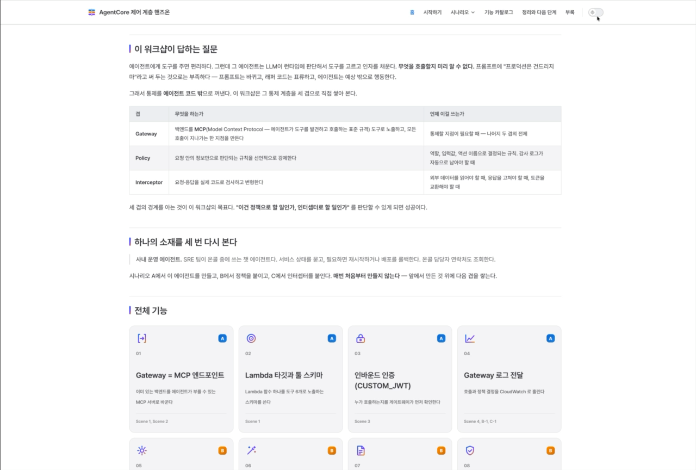

# workshop-scaffold

*[한국어 가이드](./README.ko.md)*

A Claude Code skill that turns a **topic + scenarios + target customer** into a complete hands-on AWS workshop, in the proven quick-\* VitePress format. It generates the feature catalog, scenario labs, sample datasets, AWS architecture diagrams, image slots, and customer co-branding — then a **level×role persona panel** reads it and produces concrete improvements.

Instead of building a workshop from scratch every time, you fill a validated skeleton. It's self-contained: **with only this skill installed, someone starting from nothing can build and deploy a workshop end to end.**

---

## Demo

[](media/demo.mp4)

*Click to play (mp4) — the skill generating a workshop live: mermaid flows, AWS architecture diagrams, scenario pages.*

---

## What you get

One run produces, in a target folder:

- **A VitePress site** — home, agenda, feature catalog, and per-scenario lab pages. Preview with `npm run docs:dev`; build and deploy the static output.
- **Sample datasets** — realistic data that satisfies the scenario logic (+ locale copies if requested).
- **Architecture / flow diagrams** — drawn with official AWS icons.
- **Image slots** — every screenshot/logo that isn't in yet is left as a labeled placeholder, and the capture manifest lists exactly what to shoot.
- **`brief.yaml`** — the single source of truth for this workshop's fixed values (customer, size, date, roles, scenarios, tech level…).
- **`artifacts/`** — the intermediate output of each stage (research facts, blueprint, persona reviews), so decisions are traceable.

---

## Requirements

- **Claude Code** — the environment this skill runs in.
- **Node.js 18+** — to preview and build the generated VitePress site.
- **AWS credentials** — only if you deploy (e.g. to AWS Amplify).

---

## Install

**As a plugin (recommended)** — this repo is its own marketplace:

```bash
claude plugin marketplace add netsgo0319/workshop-scaffold
claude plugin install workshop-scaffold
```

You get three skills — `workshop-scaffold` (the full pipeline), `aws-fact-check` (standalone GA/region/label verification), `persona-review` (standalone level×role panel review) — and three commands: `/new-workshop`, `/workshop-check`, `/workshop-walkthrough`.

**Or from a local clone** (air-gapped / for development):

```bash
git clone https://github.com/netsgo0319/workshop-scaffold.git
claude plugin marketplace add ./workshop-scaffold
claude plugin install workshop-scaffold
```

Restart Claude Code after installing. (Cloning straight into `~/.claude/skills/` no longer works — the skills live under `skills/`, not the repo root.)

---

## Quick start (from nothing)

```bash
# 1. Scaffold an empty workshop into a new folder
bash ~/.claude/skills/workshop-scaffold/scripts/new-workshop.sh ../my-workshop \
  --title "ACME × Bedrock" --name my-workshop --color "#0972d3"

cd ../my-workshop && npm install && npm run docs:dev   # preview the empty skeleton

# 2. Fill it with the skill: in Claude Code, run
/workshop-scaffold
#    (or just: "build a workshop about … for …")
```

Intake writes `brief.yaml`, then the pipeline fills and verifies the content stage by stage.

---

## Usage

Create an **empty folder** for the new workshop, start Claude Code in it, then:

```
/workshop-scaffold
```

Natural language works too: `"build a workshop about Claude Code on Bedrock for a food-manufacturing customer."`

The skill asks for the values that get frozen into `brief.yaml`:

| Prompted for | Example |
|---|---|
| Topic · target AWS services | "Claude Code on Bedrock", "AgentCore" |
| Audience (level × role) | L200 developer, L300 architect … |
| Scenario count · titles | 3: personal productivity / data analysis / external integration |
| Duration · format | 4.5h · hands-on / booth / presenter-led |
| Languages | ko / en / ja |
| Customer | name · logo · industry · tech level |
| Run mode | `staged` (default) or `oneshot` |

See [`assets/brief.example.yaml`](assets/brief.example.yaml) for the input shape and [`examples/hanbitpay/`](examples/hanbitpay/) for a real run's intermediate artifacts.

---

## What it does, in order (the pipeline)

Every run walks these 8 stages. In `staged` mode it **pauses at ★ for your sign-off**.

| # | Stage | What the skill does for you | Output |
|---|---|---|---|
| 1 | **Intake** | Asks for everything up front: topic, audience (level×role), scenarios, duration, format, languages — plus the **customer logo & favicon files** and **design preferences** (colors/mood; `auto` = derived from brand + service + persona) | `brief.yaml` (frozen SSOT) |
| 2 | **Research ★** | **Parallel research cells** — the company, the audience's actual roles, and each AWS technology (GA/region/preview verified fresh, confidence-labeled) | `02-feature-facts.md`, `02a/02b` context |
| 3 | **Blueprint ★** | Scenario arc & scene decomposition with **difficulty leveling** (adjacent scenes jump ≤1 level, ≤2 new concepts per scene), feature↔scene mapping, a planned visual per scene, dataset & diagram requirements | `03-blueprint.md` |
| 4 | **Generate** | **Feature catalog** (one page per feature), **scenario lab pages with copy-paste-ready prompts & code samples**, **realistic datasets** that satisfy the scene logic, **diagrams** (mermaid flows, drawio AWS-icon architecture), screenshot slots | `docs/**`, `demo_datasets/**` |
| 5 | **Assemble** | Wires VitePress config/nav/i18n, builds clean (0 dead links) | built site |
| 6 | **Review** | Two-layer review: a **level×role persona panel** critiques it, then a **fresh-eyes participant agent actually follows it** (runs steps, checks links/datasets/build/deploy) and an author agent fixes what it hits — looping until a clean round | `06-persona-review.md`, `06b-walkthrough-*` |
| 7 | **QA** | Mechanical checks (datasets, presenter notes, emoji, assets, visual-first) + build — QA is hard-blocked until the walkthrough is clean | `07-qa-report.md` |
| 8 | **Handoff** | Screenshot capture list, presenter notes pointer, deploy steps, human rehearsal checklist & known limitations | `08-handoff.md` |

**Two run modes**
- `staged` (default): stop at the Research and Blueprint ★ gates for human review. Recommended for first-time or high-stakes workshops.
- `oneshot`: run straight through, still checking the same pass conditions and stopping on violation.

**As a workflow (optional):** [`assets/workshop-pipeline.workflow.mjs`](assets/workshop-pipeline.workflow.mjs) encodes the pipeline as a multi-agent Workflow (parallel research/generation/persona cells) for maximum parallelism. It requires opting into workflow orchestration and honors the same gates.

---

## Rules the skill keeps (so you can trust the output)

To protect the credibility of what it produces, the skill deliberately **won't** do some things:

- **It never AI-generates a product screenshot.** Screenshot spots stay as "capture this here" slots — you fill them with the real screen on the day.
- **Architecture / flow diagrams use official AWS icons only.**
- **Customer logos/names are only for a genuine customer workshop's co-branding.** No fabricated testimonials, fake quotes, or unapproved logos.
- **AWS facts are verified fresh, not from memory.** Region availability and GA/preview are re-checked at run time, and what was verified vs. read in docs vs. assumed is kept as an explicit **label**.
- **Presenter-only content** (demo tips) stays in `PRESENTER_NOTES.md`, outside the deployed `docs/`.

The generated site's base theme follows [`references/format-spec.md`](references/format-spec.md) (e.g. the nav bar is opaque and pinned to the top).

---

## What's in the skill

| Path | What it is |
|---|---|
| `skills/workshop-scaffold/` | The pipeline orchestrator Claude follows |
| `skills/aws-fact-check/` | Standalone skill: verify GA/region/preview + confidence labels |
| `skills/persona-review/` | Standalone skill: level×role panel review of any artifact |
| `commands/new-workshop.md` | `/new-workshop` — scaffold a workshop folder |
| `commands/workshop-check.md` | `/workshop-check` — QA axes + participant-flow review |
| `assets/scaffold/` | The empty VitePress skeleton that gets copied and filled |
| `assets/workshop-pipeline.workflow.mjs` | The pipeline as a multi-agent workflow |
| `scripts/new-workshop.sh` | Copy the skeleton into a new folder + substitute values (bundles the enforcement scripts & hooks) |
| `scripts/workshop-check.sh` | QA checks (assets / datasets / presenter notes / visuals + build) — also runs as a Stop hook in the generated workshop |
| `scripts/gate.sh` | Hard stage-entry gate — blocks a stage whose prerequisite artifact is missing |
| `scripts/image-manifest.mjs` | List capture-pending screenshots |
| `commands/workshop-walkthrough.md` | `/workshop-walkthrough` — participant walkthrough↔author-fix loop (clears gate.sh 7) |
| `agents/participant-walker.md` | Plugin agent: fresh-eyes participant that follows the workshop for real |
| `references/format-spec.md` | Output structure & theme spec |
| `references/component-api.md` | The VitePress components you write with |
| `references/research-discipline.md` | How AWS facts get verified & labeled |
| `references/diagram-recipes.md` | Mermaid / drawio / Excalidraw recipes |
| `references/persona-rubric.md` | Level×role persona review criteria |
| `references/branding.md` | Customer tailoring & co-branding rules |
| `references/pipeline-contract.md` | Per-stage gates & invariants (advanced) |
| `references/templates/` | Feature-page and scene templates |
| `assets/brief.example.yaml` | Example input |
| `examples/hanbitpay/` | A real run's intermediate artifacts |

---

## Troubleshooting

- **The skill isn't picked up** → `claude plugin list` should show `workshop-scaffold` enabled; restart Claude Code after installing.
- **The build fails** → in the generated folder, `npm ci` then `npm run docs:build`. Check you're on Node 18+.
- **AWS info looks stale** → region/GA facts are point-in-time. Before deploying, re-check the labels and `confirmed_date` in `artifacts/`.
